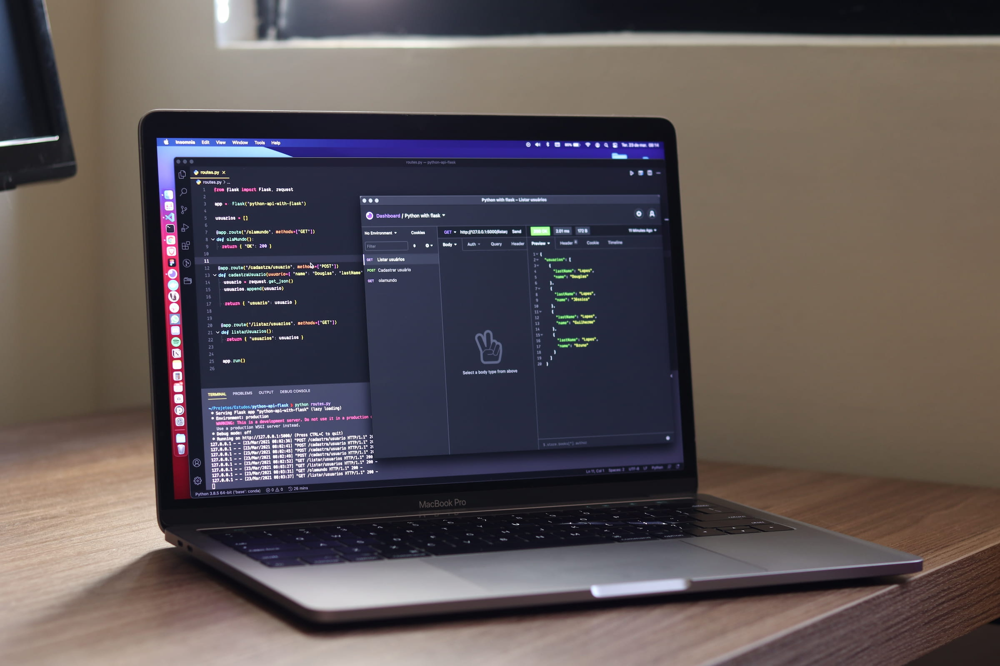

import imageChelseaHagon from '@/images/team/chelsea-hagon.jpg'

export const article = {
  date: '2023-04-06',
  title: 'The Future of Web Development: Our Predictions for 2023',
  description:
    'Let’s explore the latest trends in web development, and regurgitate some predictions we read on X for how they will shape the industry in the coming year.',
  author: {
    name: 'Chelsea Hagon',
    role: 'Senior Developer',
    image: { src: imageChelseaHagon },
  },
}

export const metadata = {
  title: article.title,
  description: article.description,
}

## 1. AI Assisted Development

With the launch of Github Copilot in 2022 the industry got its first glimpse at what it would look like to have Stack Overflow plumbed straight into your IDE. Copilot has given thousands of developers what they always longed for: plausible deniability over the bugs they write.

In 2023 we can expect these assistants to become more sophisticated and for that to have ripple effects throughout the industry.

We predict that traffic to MDN will decline precipitously as developers realise they no longer need to look up JS array methods. We also expect Stack Overflow’s sister site, Prompt Overflow, to become one of the most popular sites on the internet in a matter of months.

## 2. Rendering Patterns

To server render or not to server render? In 2022 the owners of the internet, Vercel, decided that instead of making this choice once for your whole application, now you will need to decide every time you write a new component.

Because front-end development was becoming too easy, the same people who write CSS will now need to know how Streaming SSR and Progressive Hydration work.

In 2023 we can expect frameworks to adopt increasingly granular rendering patterns culminating in per-line rendering (PLR) later this year. We can also expect job postings for Rendering Reliability Engineers to reach an all time high.

## 3. JS Runtimes

Because choosing a JS runtime was one of the only areas where a developer wasn’t paralysed with choice, in early 2020, the creator of Node gave us something new to agonise over. The launch of Deno and Bun heralded the final mutation of JavaScript into a language that can truly run anywhere it wasn’t intended to.

These new JS runtimes mean we can now serve HTML faster than ever before. For example, we’ve reduced the Time to First Byte (TTFB) of this blog to -0.4s. That means it actually loaded before you clicked the link.

In 2023 we can expect even faster and more specialised JS runtimes to launch, including the promising Boil, a runtime specifically designed to reduce cold boot times on WiFi enabled kettles. All of these advancements promise to make the future of botnets a truly exciting one.
